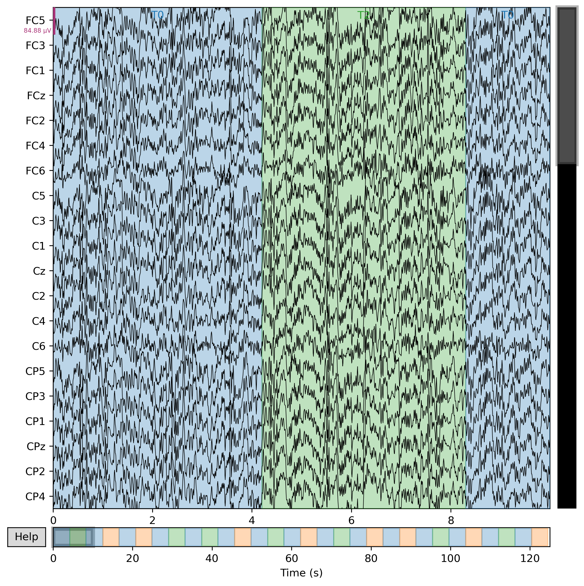

# Hybrid-Adaptive-BCI


Hybrid Brain–Computer Interface (BCI) with Adaptive Artificial Intelligence for Controlling Industrial Robots and Medical Assistive Devices.

---

# Project Overview

This project is part of my Master's Thesis in Robotics at JAMK University of Applied Sciences.

The objective is to develop a Hybrid Brain–Computer Interface (BCI) system supported by Adaptive Artificial Intelligence for controlling industrial robots and medical assistive devices using EEG signals.

---

# Table of Contents

- Project Overview
- Project Objectives
- Technologies
- Installation
- Project Structure
- Main Python Libraries
- Completed Labs
- Current Progress
- Project Pipeline
- Future Work
- Author
- Supervisor
- License

---

# Project Objectives

- EEG Signal Processing
- EEG Preprocessing
- Noise Removal
- Artifact Removal
- Feature Extraction
- Machine Learning
- Deep Learning
- Adaptive Artificial Intelligence
- ROS2 Integration
- Industrial Robot Control
- Medical Assistive Devices

---

# Technologies

- Python
- MNE-Python
- NumPy
- SciPy
- Matplotlib
- Scikit-learn
- BrainFlow
- TensorFlow
- PyTorch
- ROS2

---
# Installation

Clone the repository

```bash
git clone https://github.com/ROBOTICAbdelsalam/Hybrid-Adaptive-BCI.git
```

Move to the project folder

```bash
cd Hybrid-Adaptive-BCI
```

Install all dependencies

```bash
pip install -r requirements.txt
```


---

# Project Structure

```text
Hybrid-Adaptive-BCI
│
├── datasets
├── deep_learning
├── docs
├── feature_extraction
├── figures
├── labs
├── machine_learning
├── preprocessing
├── prototype
├── results
├── ros2
├── README.md
├── requirements.txt
├── LICENSE
└── .gitignore
```

---

# Main Python Libraries

- MNE
- NumPy
- SciPy
- Matplotlib
- Scikit-learn
- BrainFlow
- TensorFlow
- PyTorch

---

# Completed Labs

## Lab 01 – Environment Setup

Python environment preparation and project configuration.

---

## Lab 02 – EEG Dataset Loading

Loading the EEGBCI dataset using MNE-Python.

---

## Lab 03 – EDF File Reading

Reading EEG recordings from EDF files.

---

## Lab 04 – Raw EEG Visualization

Visualizing raw EEG signals.

**Outputs**

- Raw EEG Figure

---

## Lab 05 – Dataset Inspection

Inspecting EEG recording information.

**Outputs**

- Dataset Information Report

---

## Lab 06 – EEG Filtering

Applying a 1–40 Hz Band-pass filter to improve EEG signal quality.

**Outputs**

- Filtered EEG Figure
- Filtering Report

---

## Lab 07 – Independent Component Analysis (ICA)

### Lab 07.1 – ICA Training

Training the FastICA model.

### Lab 07.2 – ICA Components Visualization

Visualizing ICA components.

### Lab 07.3 – Manual Component Selection

Manual identification of artifact-related ICA components.

### Lab 07.4 – Automatic Component Detection

Automatic artifact detection using EOG channels (when available).

### Lab 07.5 – Manual Artifact Removal

Removing selected ICA components manually.

### Lab 07.6 – Automatic Artifact Removal

Automatic ICA artifact removal.

### Lab 07.7 – Before vs After Comparison

Comparison between original EEG and cleaned EEG signals.

**Outputs**

- ICA Components
- ICA Sources
- Cleaned EEG
- Comparison Figures
- Reports

---
# Sample Results

## ICA Components


---

## Original EEG


---

## Manual ICA Artifact Removal



---

## Clean EEG


# Current Progress

## Completed

- ✅ Lab 01
- ✅ Lab 02
- ✅ Lab 03
- ✅ Lab 04
- ✅ Lab 05
- ✅ Lab 06
- ✅ Lab 07

## Current Stage

🟢 EEG Preprocessing Completed

## Next Milestone

➡️ Lab 08 – Epoch Creation

---

# Project Pipeline

```text
EEG Acquisition
        │
        ▼
Load Dataset
        │
        ▼
Filtering
        │
        ▼
ICA
        │
        ▼
Artifact Removal
        │
        ▼
Epoch Creation
        │
        ▼
Feature Extraction
        │
        ▼
Machine Learning
        │
        ▼
Deep Learning
        │
        ▼
ROS2 Integration
        │
        ▼
Industrial Robot Control
```

---

# Future Work

Upcoming project stages:

- Lab 08 – Epoch Creation
- Lab 09 – Feature Extraction
- Lab 10 – Machine Learning
- Lab 11 – Deep Learning
- Lab 12 – ROS2 Integration
- Hybrid Adaptive BCI Prototype
- Real-Time Robot Control
- Thesis Publication

---

# Repository Status

**Project Status:** 🟢 Active Development

**Current Version:** v0.7.0

**Latest Completed Module:** ICA Preprocessing

---

# Author

**Mohamed Abdelsalam**

Master of Robotics

JAMK University of Applied Sciences

Finland

---

# Supervisor

**Prof. Olli Väänänen**

JAMK University of Applied Sciences

---

# License

This project is released under the MIT License.
# Repository Status

**Project Status:** 🟢 Active Development

**Current Version:** v0.7.0

**Latest Completed Module:** ICA Preprocessing

**Next Module:** Epoch Creation
Raw EEG
      │
      ▼
Filtering
      │
      ▼
ICA
      │
      ▼
Artifact Removal
      │
      ▼
Epoch Creation
      │
      ▼
Feature Extraction
      │
      ▼
Machine Learning
      │
      ▼
Deep Learning
      │
      ▼
ROS2 Integration
      │
      ▼
Hybrid Adaptive BCI
# Publications

Publications related to this project will be added here after acceptance.