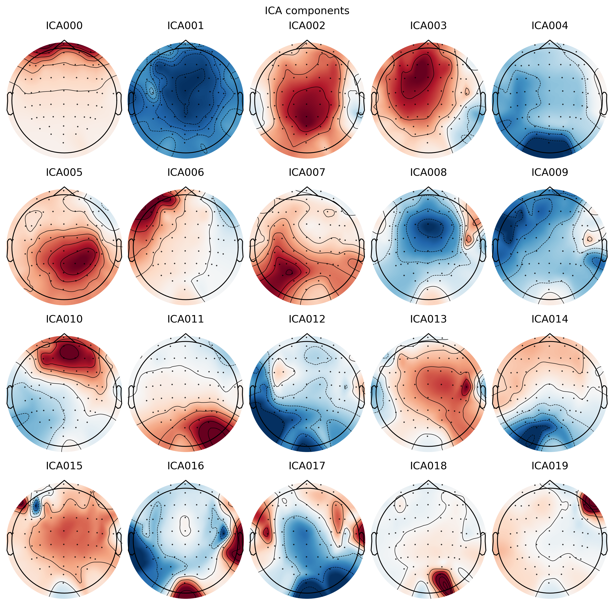

# Lab 07.2 – ICA Components Visualization

# 1. Introduction

After successfully training the Independent Component Analysis (ICA) model in the previous laboratory, the next step is to visualize the extracted independent components. Component visualization enables researchers to inspect the spatial distribution of each component before deciding whether it represents useful brain activity or an unwanted physiological artifact.

In this laboratory, the trained ICA model was used to generate graphical representations of all estimated independent components using the visualization tools provided by the MNE-Python framework.

---

# 2. Objectives

The objectives of this laboratory were:

- Visualize the independent components generated by the ICA model.
- Verify that the ICA decomposition was completed successfully.
- Generate component figures for later inspection.
- Prepare the components for manual artifact selection.

---

# 3. Scientific Background

Independent Component Analysis separates EEG recordings into statistically independent source signals.

Each independent component contains:

- A spatial distribution (topographic map).
- A corresponding signal over time.

The visualization process allows researchers to inspect these components before deciding whether they should be retained or removed.

At this stage, no modification is made to the EEG recording.

---

# 4. Software Environment

The following software was used during this laboratory:

- Python
- MNE-Python
- Matplotlib

---

# 5. Methodology

The visualization process consisted of the following steps:

1. Load the EEG recording.
2. Load the trained ICA model.
3. Generate the ICA component visualization.
4. Display all estimated components.
5. Save the generated figure.

---

# 6. Code Explanation

The implemented Python program uses the trained ICA model to visualize all independent components estimated during ICA training.

Each component is displayed as an individual topographic representation.

The generated figures provide the information required for the following laboratory, where artifact components are manually selected.

---

# 7. Generated Output

The laboratory generated the following figure:

```text
figures/lab07_ica_components_page_1.png
```

---

# 8. Figure

> ضع الصورة هنا بعد نسخها إلى:
>
> docs/images/lab07_ica_components_page_1.png

```markdown

```

**Figure 1.** ICA components generated using the FastICA algorithm.

---

# 9. Results

The visualization process completed successfully.

The generated figure contains all independent components estimated during ICA training.

These components will be inspected manually during the next laboratory to identify physiological artifacts.

---

# 10. Discussion

Component visualization is an important intermediate step between ICA model training and artifact removal.

Instead of modifying the EEG recording directly, this stage provides a visual representation of the estimated signal sources, allowing informed decisions during the manual component selection process.

---

# 11. Conclusion

Lab 07.2 successfully generated the visualization of all ICA components.

The resulting figure provides the foundation for the manual artifact identification process performed in the next laboratory.

---

# 12. References

1. Gramfort A., et al. *MNE Software for Processing MEG and EEG Data.*

2. Hyvärinen A. *Fast Independent Component Analysis.*

3. Makeig S., et al. *Independent Component Analysis of Electroencephalographic Data.*

---

# 13. Next Laboratory

**Lab 07.3 – Manual Component Selection**

The next laboratory focuses on manually identifying ICA components corresponding to physiological artifacts before EEG reconstruction.
# Files Used

## Python Script

labs/lab07_02_plot_ica.py

---

# Generated Figure


**Figure 1.** Independent components estimated using the FastICA algorithm.

---

# Figure Analysis

Figure 1 presents the ICA components extracted from the EEG recording.

Each topographic map represents one statistically independent signal source.

These components are visualized before artifact selection and will be inspected manually during the next laboratory.

## Documentation

docs/Lab07_02_ICA_Components_Visualization.md