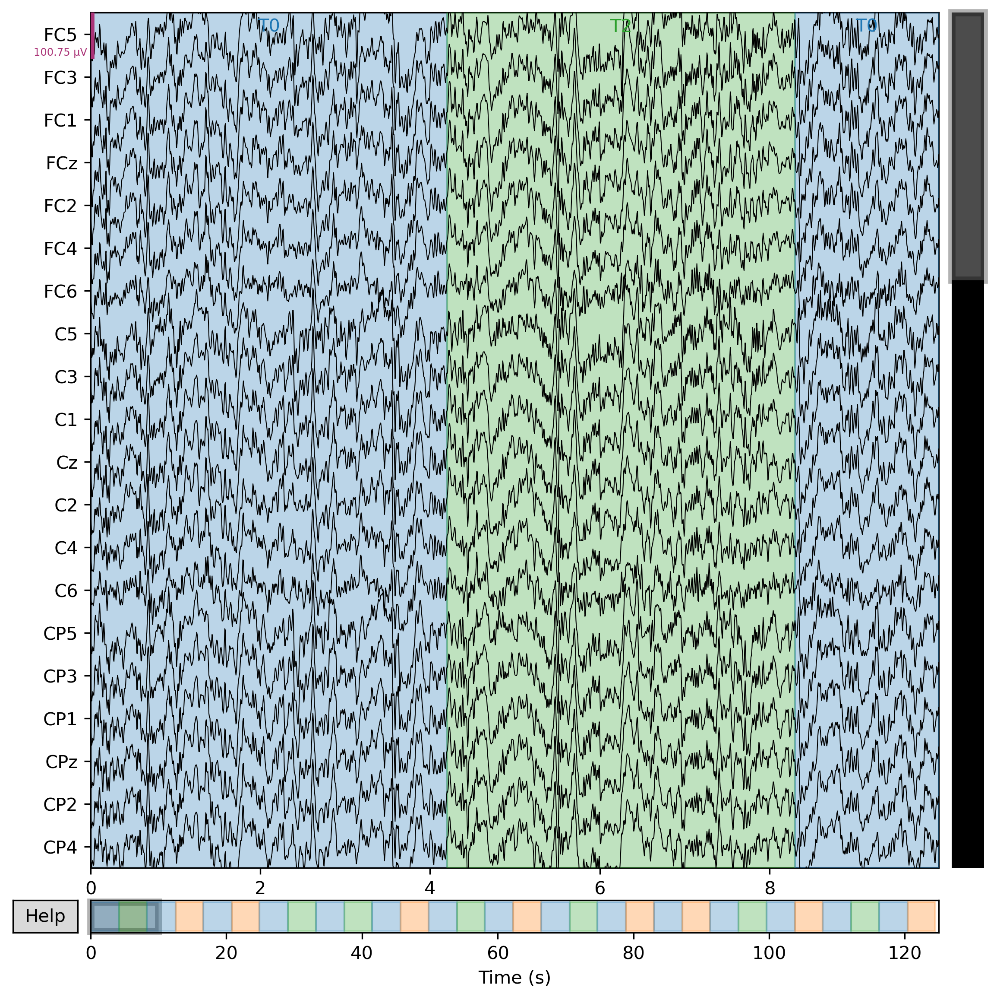

# Lab 07.6 – Automatic Artifact Removal

# 1. Introduction

Following the automatic detection of artifact-related ICA components, the next preprocessing stage consists of removing the detected components from the EEG recording.

Automatic artifact removal simplifies the preprocessing workflow by eliminating the need for manual exclusion of each component while maintaining a consistent and reproducible cleaning procedure.

In this laboratory, the automatically detected ICA components were excluded from the EEG recording using the trained ICA model.

---

# 2. Objectives

The objectives of this laboratory were:

- Load the trained ICA model.
- Load the automatically detected ICA components.
- Remove artifact-related ICA components.
- Reconstruct the cleaned EEG recording.
- Generate an automatic artifact removal report.

---

# 3. Scientific Background

Automatic artifact removal is an extension of Independent Component Analysis (ICA).

After identifying artifact-related components using automatic detection methods, these components can be excluded before reconstructing the EEG recording.

Compared with manual artifact removal, automatic removal improves reproducibility and reduces processing time.

However, automatic detection results should always be reviewed to avoid removing useful neural activity.

---

# 4. Methodology

The following procedure was performed:

1. Load the filtered EEG recording.
2. Load the trained ICA model.
3. Load the automatically detected component indices.
4. Exclude the detected components.
5. Reconstruct the cleaned EEG recording.
6. Generate the laboratory report.

---

# 5. Code Explanation

The implemented Python program loads the trained ICA model together with the filtered EEG recording.

The automatically detected ICA component indices are assigned to the ICA exclusion list.

The ICA model reconstructs the EEG recording after excluding the selected components.

Finally, the program generates a report describing the completed artifact removal process.

---

# 6. Generated Report

The following report was generated:

```text
results/lab07_06_auto_artifact_removal_report.txt
```

---

# 7. Results

The automatically detected ICA components were successfully removed.

The EEG recording was reconstructed without the excluded artifact components.

The cleaned EEG signal is now suitable for comparison with the original recording.

---

# 8. Discussion

Automatic artifact removal provides a fast and reproducible preprocessing procedure.

The combination of automatic detection and automatic removal reduces manual intervention while maintaining a consistent EEG cleaning workflow.

This approach is particularly useful when processing large EEG datasets.

---

# 9. Conclusion

Lab 07.6 successfully removed the automatically detected ICA components.

The reconstructed EEG recording contains fewer physiological artifacts and is ready for the final comparison stage.

---

# 10. Files Used

## Python Script

```text
labs/lab07_06_auto_artifact_removal.py
```

## Generated Report

```text
results/lab07_06_auto_artifact_removal_report.txt
```

## Documentation

```text
docs/Lab07_06_Automatic_Artifact_Removal.md
```

---

# 11. References

1. Gramfort A., et al. *MNE Software for Processing MEG and EEG Data.*

2. Hyvärinen A. *Fast Independent Component Analysis.*

3. Makeig S., et al. *Independent Component Analysis of Electroencephalographic Data.*

---
---

# Generated Figure



**Figure 1.** EEG recording after automatic ICA artifact removal.

---

# Figure Analysis

The automatic artifact removal process reconstructed the EEG signal after excluding the automatically detected ICA components.

This procedure reduces manual intervention while improving preprocessing efficiency.

# 12. Next Laboratory

**Lab 07.7 – Before vs After Comparison**

The next laboratory compares the original EEG recording with the cleaned EEG recording to evaluate the effectiveness of the ICA artifact removal process.