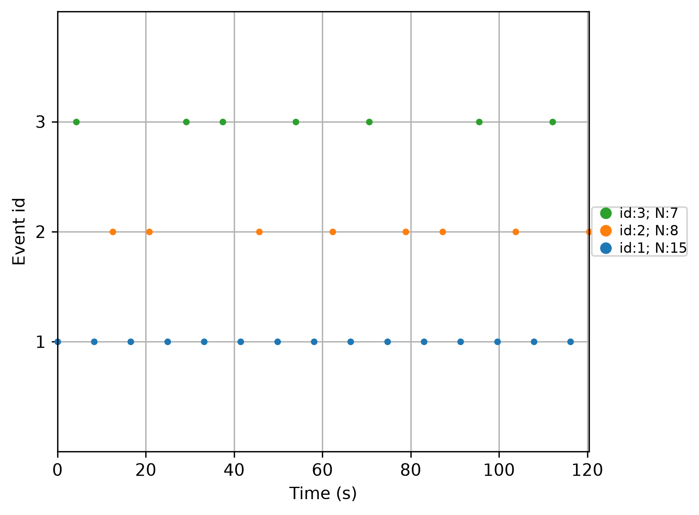

# Lab 08.1 – Event Extraction

## Objective

The objective of this laboratory is to extract experimental events from the EEG recording using the annotations provided in the EEGBCI dataset. These events represent the different motor imagery tasks performed by the subject and will be used in the following laboratory to create EEG epochs for machine learning applications.

---

## Background

Electroencephalography (EEG) recordings often contain event markers indicating when a specific experiment starts. These markers are essential because they allow continuous EEG signals to be divided into smaller time windows (epochs), each corresponding to a particular task.

In the EEGBCI dataset, event annotations are already included inside the EDF recording. The MNE-Python library converts these annotations into numerical event identifiers that can be processed automatically.

---

## Files Used

### Python Script

```
labs/lab08_01_event_extraction.py
```

### Input Dataset

EEGBCI Dataset

Subject: 1

Run: 4

---

## Methods

The following steps were performed:

1. Load the EEG recording.
2. Read annotation information from the EDF file.
3. Convert annotations into event markers.
4. Generate the event ID dictionary.
5. Display the detected events.
6. Save the extraction report.
7. Generate an event visualization figure.

---

## Results

### Event IDs

```
T0 → 1
T1 → 2
T2 → 3
```

### Number of Detected Events

```
30 Events
```

---

## Generated Files

### Report

```
results/lab08_01_event_extraction_report.txt
```

### Figure

```
figures/lab08_events.png
```

---

## Figure



**Figure 1.** Event markers extracted from the EEG recording. Each color represents one experimental condition in the EEGBCI dataset.

---


## Discussion

The event extraction process was successfully completed. Thirty event markers were detected from the recording. These events define the temporal boundaries of each experimental task and provide the information required for EEG epoch creation.

Correct event extraction is a critical preprocessing step because every subsequent stage—including epoch generation, feature extraction, machine learning, and robot control—depends on accurate event timing.

---

## Conclusion

Event extraction was successfully performed using MNE-Python. The extracted event markers will be used in the next laboratory to generate EEG epochs for further signal processing and classification.