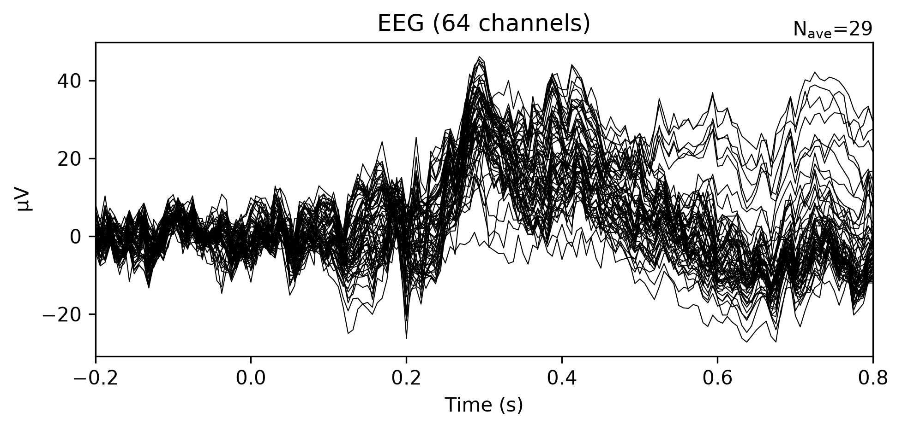

# Lab 08.2 – Epoch Creation

## Objective

The objective of this laboratory is to segment the continuous EEG recording into fixed-length epochs centered around experimental events. Epoching converts the continuous signal into independent trials that can be analyzed individually for machine learning and Brain–Computer Interface (BCI) applications.

---

## Background

After preprocessing and artifact removal, the EEG signal remains continuous. Most BCI algorithms require segmented data where every segment represents one trial corresponding to a specific motor imagery task.

The MNE-Python library provides an efficient implementation for creating epochs directly from event annotations.

---

## Dataset

- Dataset: EEG Motor Movement/Imagery Dataset
- Subject: 1
- Run: 4
- Channels: 64 EEG
- Sampling Frequency: 160 Hz

---

## Python Script
---

## Processing Parameters

| Parameter | Value |
|-----------|-------|
| tmin | -0.2 s |
| tmax | 0.8 s |
| Baseline | (-0.2, 0.0) |
| Preload | True |

---

## Results

Number of detected events:
Valid epochs:
Epoch shape:
One epoch was automatically removed because insufficient samples existed before the first event.
Detected Events : 30

Created Epochs : 29

Dropped Epochs : 1
One epoch was automatically dropped because insufficient EEG samples were available before the first event for the selected epoch window (-0.2 s to 0.8 s).
---

## Generated Figure

**Figure 1.** Average EEG response after epoch creation.

---

## Discussion

Epoch creation transforms continuous EEG recordings into independent trials suitable for statistical analysis and machine learning.

Each epoch contains synchronized EEG activity surrounding one experimental event.

This representation forms the basis for feature extraction and classification in later laboratories.

---

## Output Files
---

## Conclusion

Epoch creation was successfully completed using the MNE framework.

Twenty-nine valid EEG epochs were generated and prepared for the next laboratory involving baseline correction. 
