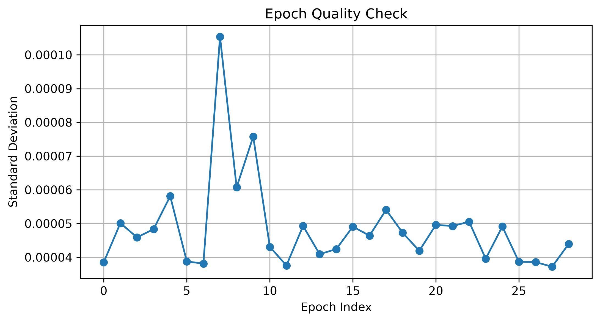

# Lab 08.5 – Epoch Quality Check

## Objective

The objective of this laboratory is to evaluate the quality of the generated EEG epochs before feature extraction and machine learning. Quality assessment ensures that the dataset does not contain invalid values or abnormal recordings.

---

## Background

Before extracting features from EEG data, it is essential to verify that the processed epochs are numerically valid and suitable for analysis.

Quality checking helps identify corrupted epochs, missing values, numerical instability, and unexpected signal behavior.

This verification step improves the reliability of subsequent machine learning models.

---

## Dataset

- Dataset: EEG Motor Movement/Imagery Dataset (EEGBCI)
- Subject: 1
- Run: 4
- Channels: 64 EEG
- Sampling Frequency: 160 Hz

---

## Python Script

```
labs/lab08_05_epoch_quality_check.py
```

---

## Quality Checks

The following tests were performed:

1. Number of valid epochs
2. Epoch dimensions
3. NaN value detection
4. Infinite value detection
5. Standard deviation analysis

---

## Results

Detected Events

```
30
```

Valid Epochs

```
29
```

Epoch Shape

```
(29, 64, 161)
```

Contains NaN

```
False
```

Contains Infinity

```
False
```

---

## Generated Files

### Report

```
results/lab08_05_epoch_quality_check_report.txt
```

### Figure

```
figures/lab08_epoch_quality.png
```

---

## Figure



**Figure 1.** Standard deviation of all valid EEG epochs used for quality assessment.

---

## Discussion

The quality assessment confirms that the processed EEG dataset is numerically stable and contains no missing or infinite values.

The standard deviation plot provides a quick overview of signal consistency across all epochs and helps identify potential outliers.

---

## Conclusion

All valid EEG epochs successfully passed the quality assessment procedure.

The dataset is ready for feature extraction and machine learning experiments.