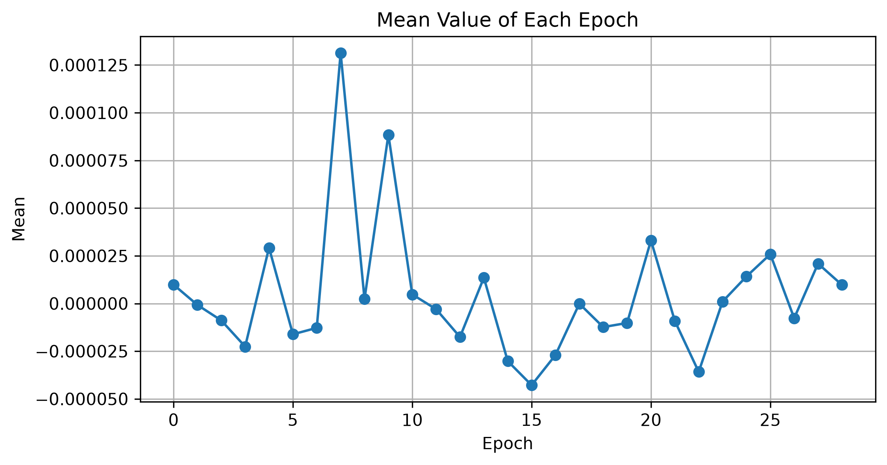

# Lab 09.1 – Time Domain Feature Extraction

## Objective

The objective of this laboratory is to extract time-domain features from the processed EEG epochs. These numerical features provide a compact representation of the EEG signals and will be used as input for machine learning and Brain–Computer Interface (BCI) classification models.

---

## Background

Time-domain features are among the most widely used EEG descriptors because they are computationally efficient and capture the statistical characteristics of brain activity.

Instead of using every EEG sample directly, feature extraction summarizes each epoch into a small number of informative values, reducing computational complexity while preserving important information.

---

## Dataset

- Dataset: EEG Motor Movement / Imagery Dataset (EEGBCI)
- Subject: 1
- Run: 4
- Channels: 64 EEG
- Sampling Frequency: 160 Hz

---

## Python Script

```
labs/lab09_01_time_domain_features.py
```

---

## Extracted Features

The following time-domain features were extracted from every EEG epoch:

- Mean
- Standard Deviation
- Maximum
- Minimum
- Peak-to-Peak Amplitude
- Root Mean Square (RMS)

---

## Results

Detected Events

```
30
```

Valid Epochs

```
29
```

Epoch Shape

```
(29, 64, 161)
```

Feature Matrix

```
29 × 6
```

Each row represents one EEG epoch.

Each column represents one extracted feature.

---

## Generated Files

### Feature Matrix

```
features/time_domain_features.csv
```

### Report

```
results/lab09_01_time_domain_features_report.txt
```

### Figure

```
figures/lab09_time_features.png
```

---

## Figure



**Figure 1.** Mean value computed for each valid EEG epoch.

---

## Discussion

The extracted time-domain features provide a compact numerical representation of the EEG signal.

These features significantly reduce data dimensionality while preserving important statistical characteristics of brain activity.

The generated feature matrix will be combined with frequency-domain and spectral features in the following laboratories.

---

## Conclusion

Time-domain feature extraction was successfully completed.

A feature matrix containing six statistical descriptors for each valid EEG epoch was generated and stored for subsequent feature analysis and machine learning experiments.