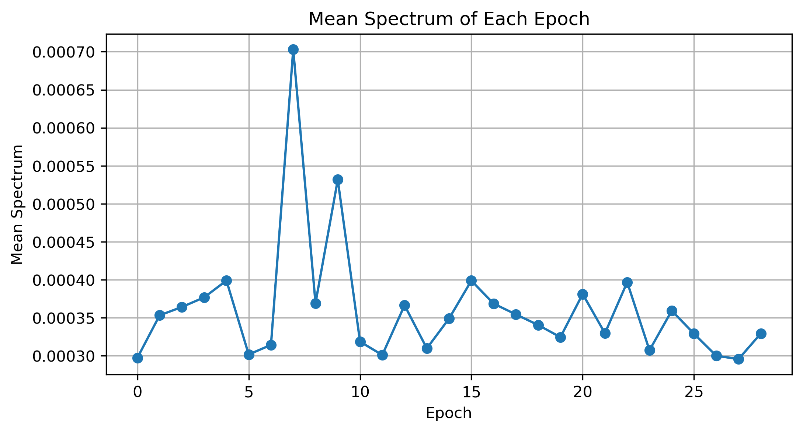

# Lab 09.2 – Frequency Domain Feature Extraction

## Objective

The objective of this laboratory is to extract frequency-domain features from the processed EEG epochs using the Fast Fourier Transform (FFT). These features describe the spectral characteristics of brain activity and complement the time-domain features extracted in the previous laboratory.

---

## Background

EEG signals consist of multiple frequency components associated with different cognitive and motor activities.

Transforming EEG signals from the time domain into the frequency domain enables spectral analysis, allowing researchers to identify dominant frequencies and signal energy distribution.

Frequency-domain analysis is one of the most important preprocessing stages for Brain–Computer Interface (BCI) systems.

---

## Dataset

- Dataset: EEG Motor Movement / Imagery Dataset (EEGBCI)
- Subject: 1
- Run: 4
- Channels: 64 EEG
- Sampling Frequency: 160 Hz

---

## Python Script

```
labs/lab09_02_frequency_domain_features.py
```

---

## Method

The Fast Fourier Transform (FFT) was applied to each EEG epoch to obtain its frequency spectrum.

The following spectral features were extracted:

- Mean Spectrum
- Maximum Spectrum
- Dominant Frequency Index

---

## Results

Detected Events

```
30
```

Valid Epochs

```
29
```

Epoch Shape

```
(29, 64, 161)
```

Feature Matrix

```
29 × 3
```

Each row represents one EEG epoch.

Each column represents one extracted frequency-domain feature.

---

## Generated Files

### Feature Matrix

```
features/frequency_domain_features.csv
```

### Report

```
results/lab09_02_frequency_domain_features_report.txt
```

### Figure

```
figures/lab09_frequency_features.png
```

---

## Figure



**Figure 1.** Mean spectral value calculated for each EEG epoch after applying the Fast Fourier Transform.

---

## Discussion

Frequency-domain analysis provides information that cannot be observed directly in the time domain.

The extracted spectral features describe the frequency content of each EEG epoch and will be combined with time-domain and statistical features in subsequent laboratories.

These features play an important role in EEG classification and Brain–Computer Interface applications.

---

## Conclusion

Frequency-domain feature extraction was successfully completed.

A frequency feature matrix was generated and stored for later use in power spectral density analysis, band power extraction, and machine learning.