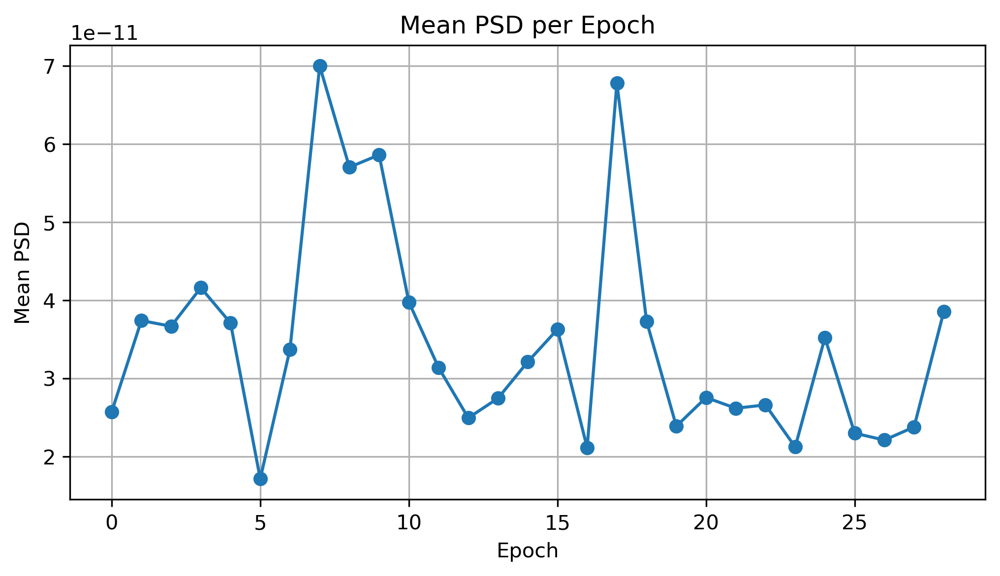

# Lab 09.3 – Power Spectral Density (PSD)

## Objective

The objective of this laboratory is to estimate the Power Spectral Density (PSD) of the processed EEG epochs using Welch's method. PSD analysis describes how the signal power is distributed across different frequency bands and is widely used in Brain–Computer Interface (BCI) research.

---

## Background

Electroencephalography (EEG) signals contain oscillatory activity distributed across multiple frequency ranges.

Unlike the Fast Fourier Transform (FFT), which represents signal amplitude in the frequency domain, the Power Spectral Density (PSD) estimates the amount of signal power present at each frequency.

Welch's method improves PSD estimation by averaging the spectra of overlapping signal segments, resulting in a smoother and more reliable spectral estimate.

PSD features are commonly used for:

- Brain–Computer Interface (BCI)
- Motor Imagery Classification
- Cognitive State Analysis
- Sleep Stage Detection
- Clinical EEG Analysis

---

## Dataset

- Dataset: EEG Motor Movement / Imagery Dataset (EEGBCI)
- Subject: 1
- Run: 4
- Source File:

```
processed_data/subject01_run04-epo.fif
```

---

## Python Script

```
labs/lab09_03_power_spectral_density.py
```

---

## Method

The PSD was computed using Welch's method.

Frequency Range

```
1 – 40 Hz
```

Extracted Features

- Mean PSD
- Maximum PSD

---

## Results

Valid Epochs

```
29
```

Epoch Shape

```
(29, 64, 161)
```

Feature Matrix

```
29 × 2
```

Each row represents one EEG epoch.

Each column represents one PSD feature.

---

## Generated Files

### Feature Matrix

```
features/psd_features.csv
```

### Report

```
results/lab09_03_psd_report.txt
```

### Figure

```
figures/lab09_psd.png
```

---

## Figure



**Figure 1.** Mean Power Spectral Density calculated for each EEG epoch using Welch's method.

---

## Discussion

Power Spectral Density analysis provides a robust description of EEG energy distribution over frequency.

Compared with the FFT, PSD estimation is less sensitive to noise and is more appropriate for quantitative EEG analysis.

The generated PSD features will be combined with the time-domain, frequency-domain, and statistical features to build the final feature matrix for machine learning.

---

## Conclusion

Power Spectral Density estimation was successfully completed.

The PSD feature matrix was generated and stored for subsequent band power extraction and machine learning analysis.

The extracted PSD features improve the spectral representation of EEG signals and contribute to more reliable Brain–Computer Interface classification models.