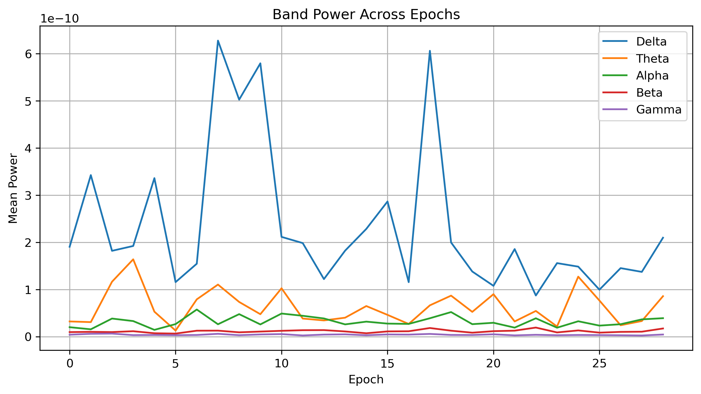

# Lab 09.4 – Band Power Extraction

## Objective

The objective of this laboratory is to extract EEG band power features from the processed epochs. Band power represents the average signal energy within specific frequency ranges and is one of the most widely used feature types in Brain–Computer Interface (BCI) systems.

---

## Background

EEG activity is commonly divided into five physiological frequency bands.

Each frequency band is associated with different brain functions and cognitive states.

Band power is computed by estimating the average Power Spectral Density (PSD) within each frequency range.

These features are extensively used in:

- Brain–Computer Interface (BCI)
- Motor Imagery Classification
- Cognitive Workload Analysis
- Neurorehabilitation
- Clinical EEG Applications

---

## Dataset

- Dataset: EEG Motor Movement / Imagery Dataset (EEGBCI)
- Subject: 1
- Run: 4

Input File

```
processed_data/subject01_run04-epo.fif
```

---

## Python Script

```
labs/lab09_04_band_power_extraction.py
```

---

## EEG Frequency Bands

| Band | Frequency Range |
|------|-----------------|
| Delta | 1–4 Hz |
| Theta | 4–8 Hz |
| Alpha | 8–13 Hz |
| Beta | 13–30 Hz |
| Gamma | 30–40 Hz |

---

## Method

The PSD of each epoch was estimated using Welch's method.

The average spectral power was then calculated separately for each EEG frequency band.

---

## Results

Valid Epochs

```
29
```

Feature Matrix

```
29 × 5
```

Each row represents one EEG epoch.

Each column represents one EEG frequency band.

---

## Generated Files

### Feature Matrix

```
features/band_power_features.csv
```

### Report

```
results/lab09_04_band_power_report.txt
```

### Figure

```
figures/lab09_band_power.png
```

---

## Figure



**Figure 1.** Average power of the Delta, Theta, Alpha, Beta, and Gamma bands across all valid EEG epochs.

---

## Discussion

Band power features provide a compact representation of EEG spectral activity.

Unlike raw FFT coefficients, band power summarizes physiologically meaningful frequency ranges that are directly related to different brain states.

These features are widely adopted in EEG classification and will form an important part of the final feature matrix.

---

## Conclusion

Band power extraction was successfully completed.

Five EEG spectral features were generated for every valid EEG epoch and stored for subsequent statistical analysis and machine learning.