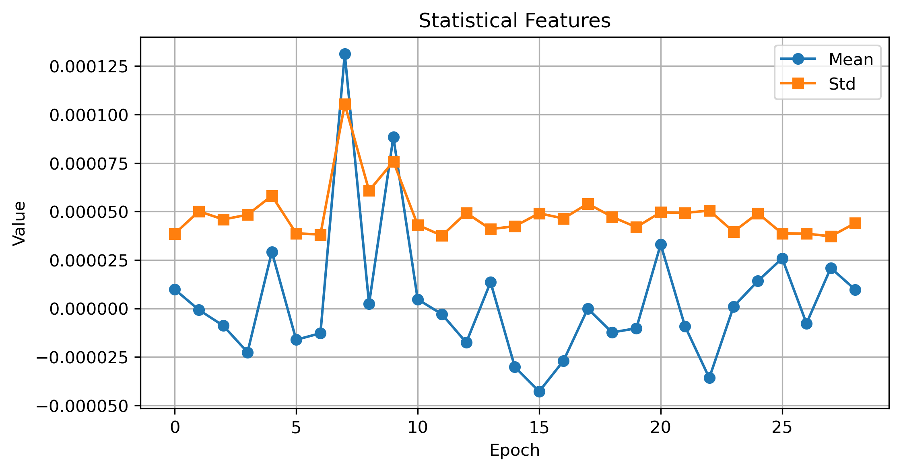

# Lab 09.5 – Statistical Feature Extraction

## Objective

The objective of this laboratory is to extract statistical features from the processed EEG epochs. These features summarize the statistical properties of EEG signals and provide informative descriptors for machine learning and Brain–Computer Interface (BCI) applications.

---

## Background

Statistical feature extraction transforms raw EEG signals into compact numerical representations by calculating descriptive statistics.

These features capture important characteristics of signal distribution, variability, and shape while significantly reducing data dimensionality.

Statistical descriptors are commonly combined with time-domain and frequency-domain features to improve EEG classification performance.

---

## Dataset

- Dataset: EEG Motor Movement / Imagery Dataset (EEGBCI)
- Subject: 1
- Run: 4

Input File

```
processed_data/subject01_run04-epo.fif
```

---

## Python Script

```
labs/lab09_05_statistical_features.py
```

---

## Extracted Statistical Features

The following statistical features were calculated for each EEG epoch:

- Mean
- Standard Deviation
- Variance
- Median
- Skewness
- Kurtosis

---

## Results

Valid Epochs

```
29
```

Epoch Shape

```
(29, 64, 161)
```

Feature Matrix

```
29 × 6
```

Each row represents one EEG epoch.

Each column represents one extracted statistical feature.

---

## Generated Files

### Feature Matrix

```
features/statistical_features.csv
```

### Report

```
results/lab09_05_statistical_features_report.txt
```

### Figure

```
figures/lab09_statistical_features.png
```

---

## Figure



**Figure 1.** Mean and standard deviation values calculated for each valid EEG epoch.

---

## Discussion

Statistical features describe the overall characteristics of EEG signals without requiring frequency analysis.

The combination of central tendency (mean, median), variability (standard deviation, variance), and distribution shape (skewness, kurtosis) provides a comprehensive statistical representation of each epoch.

These features complement the previously extracted time-domain, frequency-domain, PSD, and band power features.

---

## Conclusion

Statistical feature extraction was successfully completed.

A statistical feature matrix containing six descriptors per EEG epoch was generated and stored for subsequent feature selection and machine learning experiments.

The extracted features will be integrated with other feature groups to build the final feature matrix used for EEG classification.