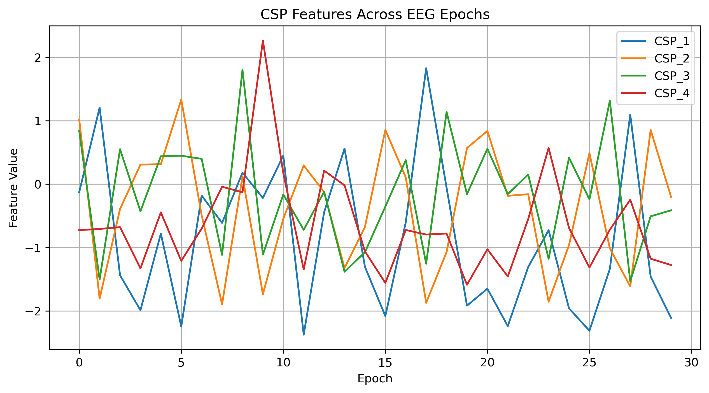

# Lab 10.3 – Transform EEG Signals Using Common Spatial Patterns (CSP)

## Objective

The objective of this laboratory is to transform EEG epochs into low-dimensional spatial feature vectors using the trained Common Spatial Patterns (CSP) model.

These transformed features provide a compact representation of EEG spatial information and are suitable for machine learning classification.

---

## Background

After training the CSP model, EEG epochs can be projected into a new feature space where the variance differences between classes are maximized.

Instead of using hundreds of EEG channels and time samples, each epoch is represented by only a few CSP components.

This significantly reduces computational complexity while preserving discriminative information.

---

## Dataset

- Dataset: EEG Motor Movement / Imagery Dataset (EEGBCI)
- Subject: 1
- Run: 4

Input Files

```
processed_data/subject01_run04-epo.fif

csp/csp_model.pkl
```

---

## Python Script

```
labs/lab10_03_transform_eeg_signals.py
```

---

## Processing Steps

1. Load the trained CSP model.
2. Load the EEG epochs.
3. Apply the CSP transformation.
4. Generate spatial feature vectors.
5. Visualize CSP features.
6. Save the generated figure.
7. Generate a processing report.

---

## Results

Output Feature File

```
csp/csp_features.csv
```

Generated Figure

```
figures/lab10_csp_features.png
```

Generated Report

```
results/lab10_03_transform_eeg_signals_report.txt
```

---

## Figure



**Figure 1.** CSP feature values across all EEG epochs after spatial transformation.

---

## Discussion

The CSP transformation converts high-dimensional EEG signals into a small set of informative spatial components.

These transformed features emphasize class-specific brain activity while reducing redundant information.

The resulting feature vectors are computationally efficient and well suited for classical machine learning algorithms.

---

## Conclusion

The EEG epochs were successfully transformed into CSP feature vectors.

The generated features and visualization provide the foundation for the next laboratory, where CSP spatial filters and activation patterns will be analyzed in greater detail.
