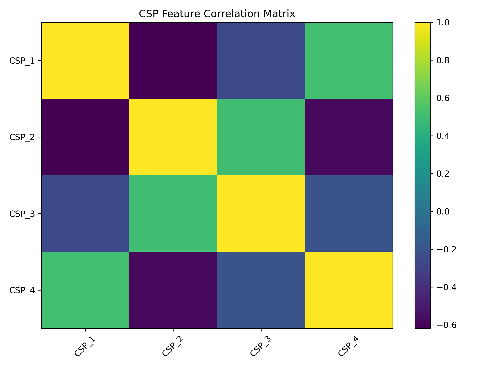

# Lab 10.4 – CSP Feature Analysis

## Objective

The objective of this laboratory is to analyze the Common Spatial Patterns (CSP) features extracted from EEG signals using descriptive statistics and correlation analysis.

This analysis validates the quality of the extracted spatial features before they are used for machine learning classification.

---

## Background

After transforming EEG epochs into CSP feature vectors, it is important to evaluate their statistical properties.

Descriptive statistics provide insight into the distribution of each CSP component, while the correlation matrix reveals relationships between components and helps identify redundant information.

This validation step ensures that the extracted features are informative and suitable for classification tasks.

---

## Dataset

Dataset:

EEG Motor Movement / Imagery Dataset (EEGBCI)

Subject:

```
Subject 01
```

Run:

```
Run 04
```

Input File

```
csp/csp_features.csv
```

---

## Python Script

```
labs/lab10_04_csp_feature_analysis.py
```

---

## Processing Steps

1. Load CSP feature matrix.
2. Compute descriptive statistics.
3. Save statistics as CSV.
4. Calculate feature correlation matrix.
5. Generate correlation heatmap.
6. Save the figure.
7. Generate analysis report.

---

## Generated Files

### Statistics

```
results/lab10_04_csp_statistics.csv
```

### Analysis Report

```
results/lab10_04_csp_feature_analysis_report.txt
```

### Correlation Figure

```
figures/lab10_csp_correlation.png
```

### Documentation Figure

```
docs/images/lab10_csp_correlation.png
```

---

## Statistical Measures

The following statistical measures were calculated for each CSP component:

- Count
- Mean
- Standard Deviation
- Minimum
- 25th Percentile
- Median (50%)
- 75th Percentile
- Maximum

---

## Correlation Analysis

A correlation matrix was generated to evaluate the relationships between CSP components.

The heatmap provides a visual representation of positive and negative correlations among the extracted spatial features.

This helps identify redundant information before training machine learning models.

---

## Figure



**Figure 10.4** Correlation matrix of the extracted Common Spatial Pattern (CSP) features.

---

## Results

Successfully generated:

- CSP statistical summary
- CSP correlation matrix
- Heatmap visualization
- Analysis report

The extracted CSP features demonstrated stable statistical characteristics and are ready for machine learning applications.

---

## Discussion

The statistical analysis confirms that the CSP transformation produced meaningful spatial features with measurable variance.

The correlation matrix provides additional insight into feature dependencies and supports feature validation prior to classifier training.

Such analysis is considered an important preprocessing step in Brain–Computer Interface (BCI) research.

---

## Conclusion

The extracted CSP features were successfully analyzed using descriptive statistics and correlation analysis.

The generated reports and visualizations validate the quality of the spatial features and prepare the dataset for the next laboratory, where the finalized CSP feature set will be saved for machine learning experiments.
