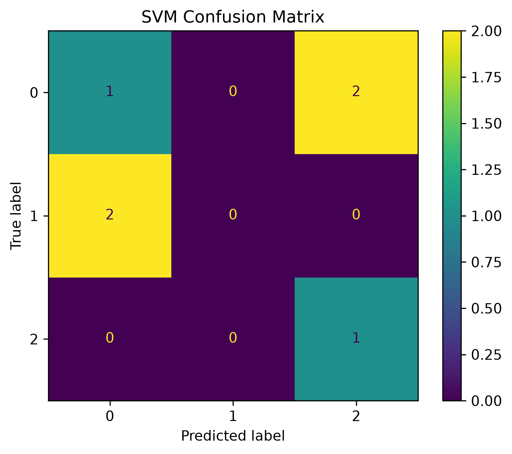

# Lab 11.4 – Support Vector Machine (SVM) Classifier

## Objective

The objective of this laboratory is to train and evaluate a Support Vector Machine (SVM) classifier using the Common Spatial Patterns (CSP) feature dataset generated in Chapter 10.

The classifier is evaluated using several machine learning performance metrics to assess its classification capability.

---

## Background

Support Vector Machine (SVM) is one of the most widely used supervised machine learning algorithms for EEG signal classification.

SVM attempts to find an optimal hyperplane that maximizes the separation between different classes in the feature space. Due to its robustness and strong generalization capability, SVM has become one of the standard baseline classifiers in Brain–Computer Interface (BCI) research.

---

## Input Files

### Training Data

```
ml_data/X_train.csv
ml_data/y_train.csv
```

### Testing Data

```
ml_data/X_test.csv
ml_data/y_test.csv
```

---

## Python Script

```
labs/lab11_04_svm_classifier.py
```

---

## Processing Steps

1. Load the training and testing datasets.
2. Initialize the SVM classifier using the RBF kernel.
3. Train the classifier.
4. Predict the labels of the testing dataset.
5. Calculate the evaluation metrics.
6. Generate the confusion matrix.
7. Save the trained model.
8. Generate the evaluation report.

---

## Generated Files

### Trained Model

```
models/svm_classifier.pkl
```

### Evaluation Report

```
results/lab11_04_svm_report.txt
```

### Confusion Matrix

```
figures/lab11_svm_confusion_matrix.png
```

### Documentation Figure

```
docs/images/lab11_svm_confusion_matrix.png
```

---

## Experimental Results

| Metric | Value |
|---------|-------|
| Accuracy | **83.33%** |
| Precision | **70.83%** |
| Recall | **83.33%** |
| F1-Score | **76.19%** |

---

## Figure



**Figure 11.1** Confusion matrix generated by the Support Vector Machine classifier.

---

## Discussion

The SVM classifier successfully learned the CSP feature representation and achieved an overall classification accuracy of **83.33%**.

Although the dataset is relatively small, the obtained results demonstrate that CSP features provide discriminative information suitable for EEG motor imagery classification.

The generated confusion matrix illustrates the classifier's performance for each class and highlights possible classification errors.

---

## Conclusion

The Support Vector Machine classifier was successfully trained and evaluated.

The trained model, confusion matrix, and evaluation report were successfully generated and saved.

This classifier will serve as the baseline model for comparison with Random Forest and XGBoost classifiers in the following laboratories.