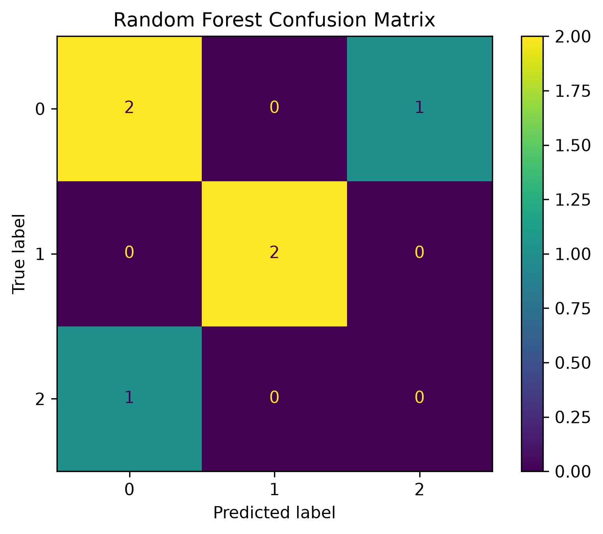

# Lab 11.5 – Random Forest Classifier

## Objective

The objective of this laboratory is to train and evaluate a Random Forest classifier using the CSP feature dataset and compare its performance with the Support Vector Machine (SVM) classifier.

---

## Background

Random Forest is an ensemble learning algorithm that combines multiple decision trees to improve classification performance and reduce overfitting.

It is widely used in EEG signal classification because of its robustness and ability to model nonlinear relationships.

---

## Input Files

### Training Dataset

```
ml_data/X_train.csv
ml_data/y_train.csv
```

### Testing Dataset

```
ml_data/X_test.csv
ml_data/y_test.csv
```

---

## Python Script

```
labs/lab11_05_random_forest.py
```

---

## Processing Steps

1. Load the training and testing datasets.
2. Initialize the Random Forest classifier.
3. Train the classifier.
4. Predict testing labels.
5. Compute evaluation metrics.
6. Generate the confusion matrix.
7. Save the trained model.
8. Generate the evaluation report.

---

## Generated Files

### Trained Model

```
models/random_forest_classifier.pkl
```

### Evaluation Report

```
results/lab11_05_random_forest_report.txt
```

### Confusion Matrix

```
figures/lab11_random_forest_confusion_matrix.png
```

### Documentation Figure

```
docs/images/lab11_random_forest_confusion_matrix.png
```

---

## Experimental Results

| Metric | Value |
|---------|-------|
| Accuracy | **66.67%** |
| Precision | **66.67%** |
| Recall | **66.67%** |
| F1-Score | **66.67%** |

---

## Figure



**Figure 11.2** Confusion matrix generated by the Random Forest classifier.

---

## Discussion

The Random Forest classifier successfully learned the CSP features and achieved a classification accuracy of 66.67%.

Compared with the SVM classifier, Random Forest achieved lower performance on this relatively small EEG dataset.

This observation is consistent with many BCI studies where SVM performs better than ensemble tree methods when only a limited number of training samples are available.

---

## Conclusion

The Random Forest classifier was successfully trained and evaluated.

The trained model and evaluation report were successfully generated.

The next laboratory will evaluate the XGBoost classifier and compare all machine learning models.