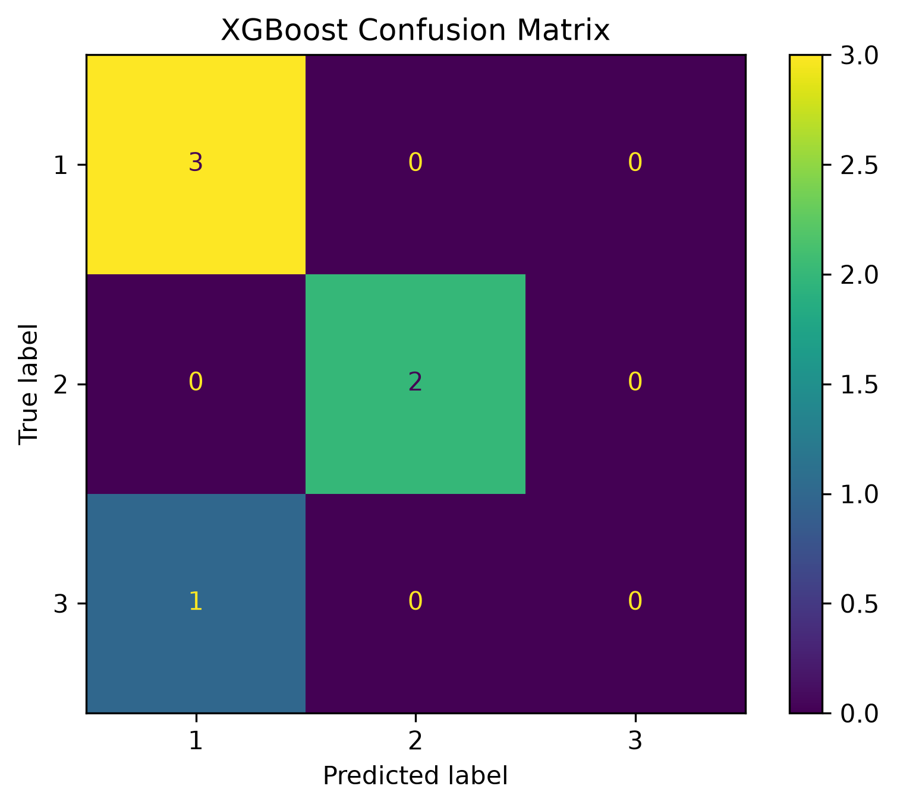

# Lab 11.6 – XGBoost Classifier

## Objective

The objective of this laboratory is to train and evaluate an Extreme Gradient Boosting (XGBoost) classifier using the Common Spatial Patterns (CSP) feature dataset.

The trained model is evaluated using standard machine learning performance metrics and compared with the previously developed Support Vector Machine (SVM) and Random Forest classifiers.

---

## Background

Extreme Gradient Boosting (XGBoost) is one of the most powerful ensemble learning algorithms for supervised classification tasks.

XGBoost builds multiple decision trees sequentially, where each new tree attempts to correct the errors made by previous trees. This gradient boosting strategy often provides superior predictive performance while maintaining efficient computation.

Because of its high accuracy and robustness, XGBoost has become one of the most widely adopted machine learning algorithms in biomedical signal processing and Brain–Computer Interface (BCI) research.

---

## Input Files

### Training Dataset

```
ml_data/X_train.csv
ml_data/y_train.csv
```

### Testing Dataset

```
ml_data/X_test.csv
ml_data/y_test.csv
```

---

## Python Script

```
labs/lab11_06_xgboost_classifier.py
```

---

## Processing Steps

1. Load the training and testing datasets.
2. Encode class labels using LabelEncoder.
3. Initialize the XGBoost classifier.
4. Train the model.
5. Predict testing labels.
6. Calculate evaluation metrics.
7. Generate the confusion matrix.
8. Save the trained model and label encoder.
9. Generate the evaluation report.

---

## Generated Files

### Trained Model

```
models/xgboost_classifier.pkl
```

### Label Encoder

```
models/xgboost_label_encoder.pkl
```

### Evaluation Report

```
results/lab11_06_xgboost_report.txt
```

### Confusion Matrix

```
figures/lab11_xgboost_confusion_matrix.png
```

### Documentation Figure

```
docs/images/lab11_xgboost_confusion_matrix.png
```

---

## Performance Metrics

The following evaluation metrics are calculated automatically after training:

- Accuracy
- Precision
- Recall
- F1-Score

The numerical values obtained during execution are recorded in:

```
results/lab11_06_xgboost_report.txt
```

---

## Figure



**Figure 11.3** Confusion matrix generated by the XGBoost classifier.

---

## Discussion

The XGBoost classifier was successfully trained using the CSP feature dataset.

Unlike the previous classifiers, XGBoost requires class labels to start from zero. Therefore, a LabelEncoder was used to transform the original EEG event labels into consecutive integer values while preserving the original class mapping.

The obtained evaluation metrics provide an additional benchmark for comparison with SVM and Random Forest models.

---

## Conclusion

The XGBoost classifier was successfully implemented, trained, and evaluated.

The trained model, label encoder, confusion matrix, and evaluation report were successfully generated.

The obtained results will be compared with the SVM and Random Forest classifiers in the next laboratory to determine the best-performing model for EEG motor imagery classification.