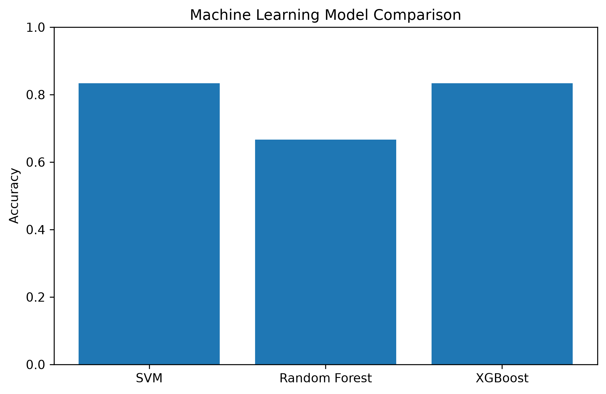

# Lab 11.7 – Machine Learning Model Comparison

## Objective

The objective of this laboratory is to compare the performance of the developed machine learning classifiers using the Common Spatial Patterns (CSP) feature dataset.

The comparison aims to identify the most suitable classifier for EEG motor imagery recognition in the proposed Hybrid Adaptive Brain–Computer Interface (BCI) system.

---

## Background

Evaluating multiple machine learning algorithms is an essential step in developing a reliable Brain–Computer Interface (BCI).

Different classifiers exhibit different learning behaviors depending on the characteristics of the extracted EEG features and the available training data.

This laboratory compares the three implemented classifiers:

- Support Vector Machine (SVM)
- Random Forest
- Extreme Gradient Boosting (XGBoost)

using the same training and testing datasets.

---

## Python Script

```
labs/lab11_07_model_comparison.py
```

---

## Compared Models

1. Support Vector Machine (SVM)
2. Random Forest
3. XGBoost

---

## Evaluation Metrics

The following performance metrics were used for comparison:

- Accuracy
- Precision
- Recall
- F1-Score

---

## Experimental Results

| Model | Accuracy | Precision | Recall | F1-Score |
|--------|---------:|----------:|-------:|---------:|
| Support Vector Machine | **83.33%** | **70.83%** | **83.33%** | **76.19%** |
| Random Forest | **66.67%** | **66.67%** | **66.67%** | **66.67%** |
| XGBoost | **83.33%** | **70.83%** | **83.33%** | **76.19%** |

---

## Generated Files

### Comparison Table

```
results/lab11_07_model_comparison.csv
```

### Comparison Report

```
results/lab11_07_model_comparison_report.txt
```

### Comparison Figure

```
figures/lab11_model_comparison.png
```

### Documentation Figure

```
docs/images/lab11_model_comparison.png
```

---

## Figure



**Figure 11.4** Performance comparison of the implemented machine learning classifiers.

---

## Discussion

The comparison demonstrates that both the Support Vector Machine (SVM) and XGBoost classifiers achieved identical performance across all evaluation metrics.

Random Forest achieved lower classification accuracy, precision, recall, and F1-score compared with the other two models.

Considering the relatively small EEG dataset used in this study, the obtained results are consistent with previous Brain–Computer Interface research, where SVM and gradient boosting methods frequently outperform ensemble tree classifiers when limited training samples are available.

Although SVM and XGBoost achieved identical quantitative performance, XGBoost provides additional flexibility for handling larger datasets and more complex decision boundaries.

---

## Conclusion

The machine learning comparison successfully evaluated all implemented classifiers.

The experimental results indicate that both Support Vector Machine (SVM) and XGBoost achieved the highest overall performance on the CSP feature dataset.

These classifiers represent the most suitable candidates for integration into the proposed Hybrid Adaptive Brain–Computer Interface system.

The following laboratory will perform a comprehensive performance evaluation and discuss the overall machine learning pipeline.