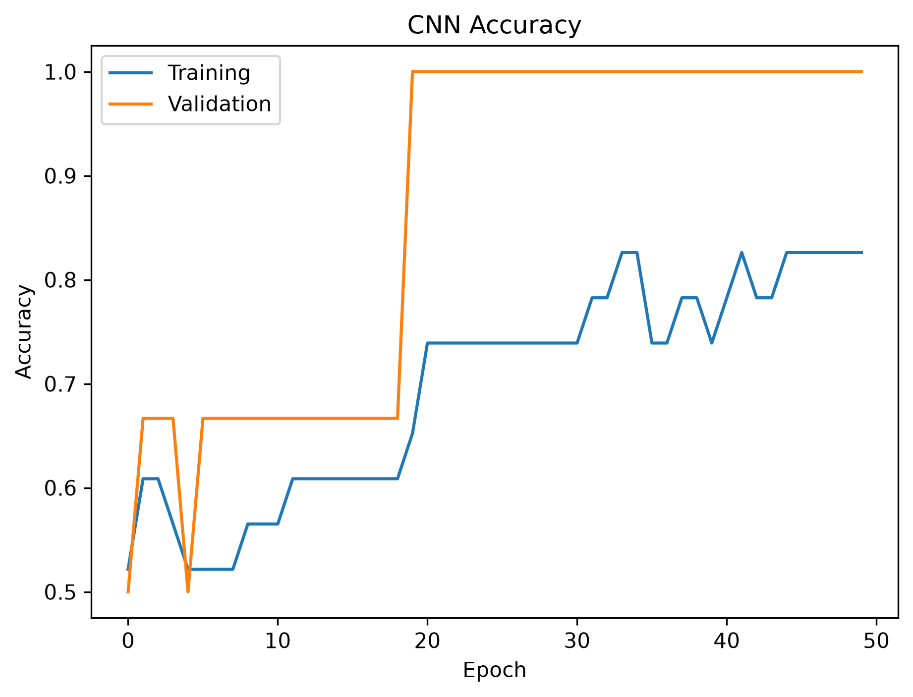
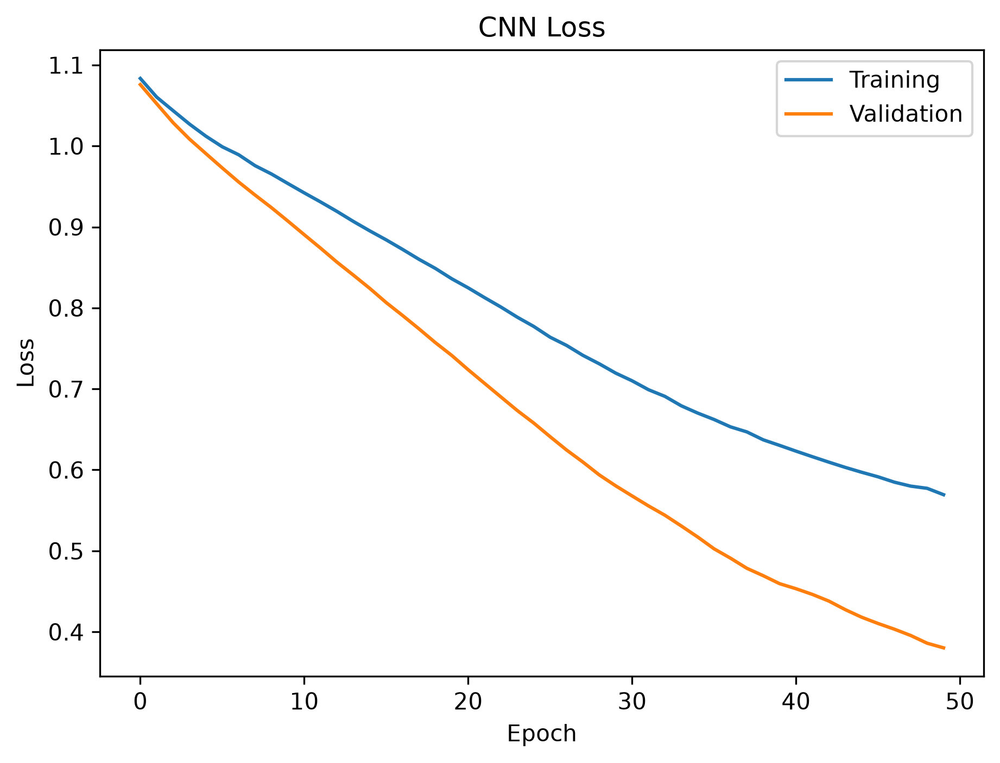
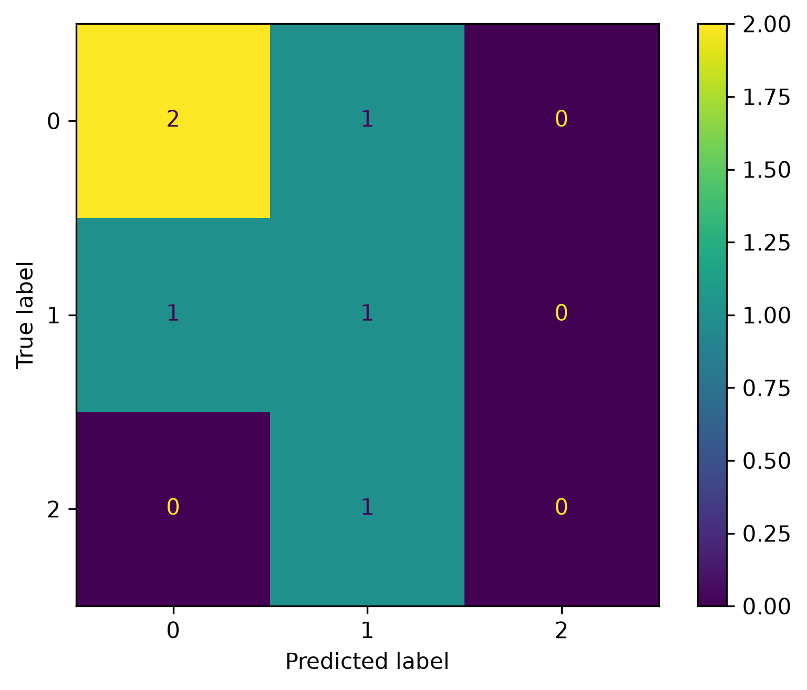

# Lab 12.2 – CNN Classifier

## Objective

The objective of this laboratory is to develop and evaluate a Convolutional Neural Network (CNN) for EEG motor imagery classification using the Common Spatial Patterns (CSP) feature dataset prepared in Lab 12.1.

The CNN model serves as the first Deep Learning classifier in the proposed Hybrid Adaptive Brain–Computer Interface (BCI) framework.

---

## Background

Convolutional Neural Networks (CNNs) are among the most successful Deep Learning architectures for feature extraction and classification.

Although CNNs are traditionally used for image analysis, they can also learn meaningful spatial patterns from EEG feature vectors.

Compared with conventional Machine Learning algorithms, CNNs automatically learn feature representations during training, reducing the need for manual feature engineering.

---

## Python Script

```
labs/lab12_02_cnn_classifier.py
```

---

## Input Files

### Deep Learning Dataset

```
dl_data/X_train.npy
dl_data/X_test.npy
dl_data/y_train.npy
dl_data/y_test.npy
```

---

## Processing Steps

1. Load the prepared Deep Learning dataset.
2. Convert labels into one-hot encoded vectors.
3. Build the CNN architecture.
4. Compile the network using the Adam optimizer.
5. Train the CNN model.
6. Predict testing samples.
7. Compute evaluation metrics.
8. Generate the confusion matrix.
9. Plot training accuracy and loss curves.
10. Save the trained CNN model and training history.
11. Generate the evaluation report.

---

## CNN Architecture

The implemented network consists of:

- Conv1D Layer (32 filters)
- MaxPooling1D Layer
- Flatten Layer
- Dense Hidden Layer (64 neurons)
- Softmax Output Layer

---

## Generated Files

### Trained Model

```
deep_learning/cnn_classifier.keras
```

### Training History

```
deep_learning/cnn_history.pkl
```

### Evaluation Report

```
results/lab12_02_cnn_report.txt
```

### Confusion Matrix

```
figures/lab12_cnn_confusion_matrix.png
```

### Accuracy Curve

```
figures/lab12_cnn_accuracy.png
```

### Loss Curve

```
figures/lab12_cnn_loss.png
```

### Documentation Images

```
docs/images/lab12_cnn_confusion_matrix.png
docs/images/lab12_cnn_accuracy.png
docs/images/lab12_cnn_loss.png
```

---

## Evaluation Metrics

The following metrics are calculated automatically:

- Accuracy
- Precision
- Recall
- F1-Score

The numerical results are stored in:

```
results/lab12_02_cnn_report.txt
```

---

## Figures

### CNN Accuracy Curve



**Figure 12.1** CNN training and validation accuracy.

---

### CNN Loss Curve



**Figure 12.2** CNN training and validation loss.

---

### CNN Confusion Matrix



**Figure 12.3** Confusion matrix of the CNN classifier.

---

## Discussion

The CNN model was successfully trained using the prepared CSP feature dataset.

The training process produced learning curves that illustrate the convergence behavior of the network during optimization.

The confusion matrix and evaluation metrics provide a quantitative assessment of the classifier's ability to recognize EEG motor imagery classes.

The obtained results will later be compared with the LSTM and CNN-LSTM models developed in the following laboratories.

---

## Conclusion

A Convolutional Neural Network (CNN) classifier was successfully implemented, trained, and evaluated.

The trained model, learning curves, confusion matrix, and evaluation report were successfully generated and saved.

The CNN model represents the first Deep Learning baseline for comparison with more advanced architectures in the subsequent laboratories.