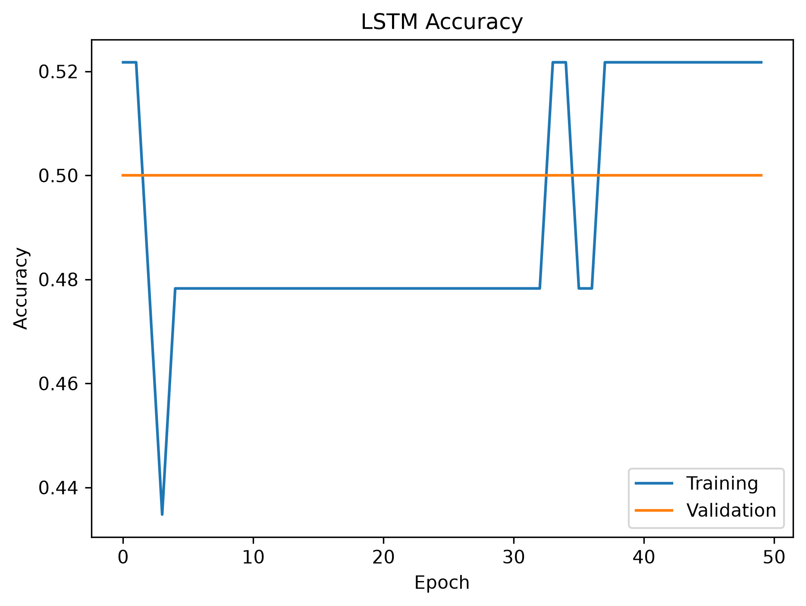
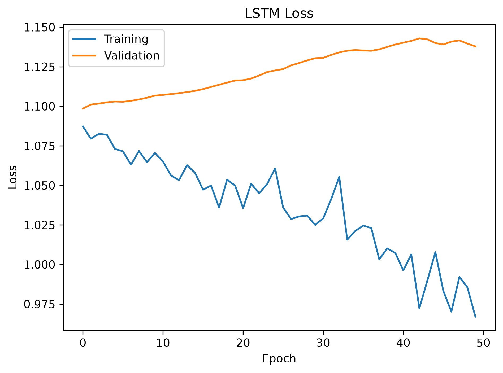
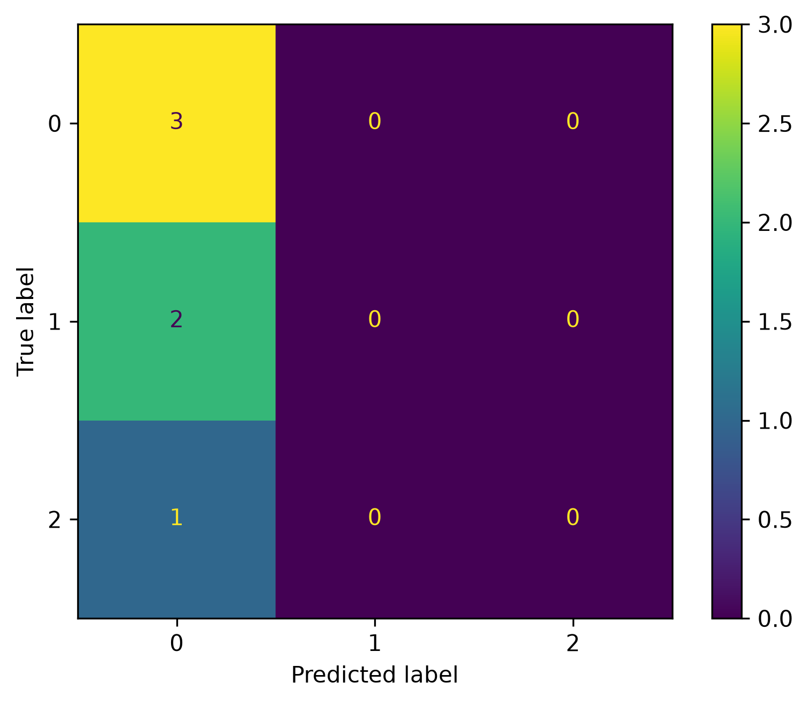

# Lab 12.3 – LSTM Classifier

## Objective

The objective of this laboratory is to design, train, and evaluate a Long Short-Term Memory (LSTM) neural network for EEG motor imagery classification using the Deep Learning dataset prepared in Lab 12.1.

The LSTM model is implemented to investigate its ability to learn temporal dependencies from EEG feature sequences and to compare its performance with the CNN model developed in Lab 12.2.

---

## Background

Long Short-Term Memory (LSTM) is a specialized Recurrent Neural Network (RNN) architecture designed to learn sequential and time-dependent information.

Unlike conventional neural networks, LSTM models maintain internal memory cells that preserve information over long time intervals, making them suitable for biosignal analysis such as EEG.

LSTM networks have been widely applied in Brain–Computer Interface (BCI) research due to their capability to capture temporal dynamics of neural activity.

---

## Python Script

```
labs/lab12_03_lstm_classifier.py
```

---

## Input Files

### Deep Learning Dataset

```
dl_data/X_train.npy
dl_data/X_test.npy
dl_data/y_train.npy
dl_data/y_test.npy
```

---

## Processing Steps

1. Load the prepared Deep Learning dataset.
2. Convert class labels into one-hot encoded vectors.
3. Build the LSTM neural network architecture.
4. Compile the model using the Adam optimizer.
5. Train the network.
6. Predict testing samples.
7. Compute evaluation metrics.
8. Generate the confusion matrix.
9. Plot training accuracy and loss curves.
10. Save the trained model and training history.
11. Generate the evaluation report.

---

## LSTM Architecture

The implemented network consists of:

- LSTM Layer (64 Units)
- Dropout Layer (30%)
- Dense Hidden Layer (32 Neurons)
- Softmax Output Layer

---

## Generated Files

### Trained Model

```
deep_learning/lstm_classifier.keras
```

### Training History

```
deep_learning/lstm_history.pkl
```

### Evaluation Report

```
results/lab12_03_lstm_report.txt
```

### Confusion Matrix

```
figures/lab12_lstm_confusion_matrix.png
```

### Accuracy Curve

```
figures/lab12_lstm_accuracy.png
```

### Loss Curve

```
figures/lab12_lstm_loss.png
```

### Documentation Images

```
docs/images/lab12_lstm_confusion_matrix.png
docs/images/lab12_lstm_accuracy.png
docs/images/lab12_lstm_loss.png
```

---

## Experimental Results

| Metric | Value |
|---------|-------:|
| Accuracy | **50.00%** |
| Precision | **25.00%** |
| Recall | **50.00%** |
| F1-Score | **33.33%** |

---

## Figures

### LSTM Accuracy Curve



**Figure 12.4** Training and validation accuracy of the LSTM model.

---

### LSTM Loss Curve



**Figure 12.5** Training and validation loss during model optimization.

---

### LSTM Confusion Matrix



**Figure 12.6** Confusion matrix obtained using the LSTM classifier.

---

## Discussion

The LSTM classifier was successfully trained and evaluated using the prepared EEG dataset.

The model achieved an overall classification accuracy of **50.00%**.

Compared with the CNN model, the LSTM classifier demonstrated lower performance on the current dataset.

This behavior is expected because the EEG dataset used in this study contains only **23 training samples** and **6 testing samples**, which is relatively small for training recurrent neural networks.

LSTM models generally require larger datasets to effectively learn temporal dependencies and achieve higher classification accuracy.

---

## Conclusion

A Long Short-Term Memory (LSTM) classifier was successfully implemented, trained, and evaluated.

The trained model, learning curves, confusion matrix, and evaluation report were successfully generated and saved.

The obtained results will be compared with the CNN and CNN–LSTM models in the following laboratories to determine the most suitable Deep Learning architecture for the proposed Hybrid Adaptive Brain–Computer Interface system.