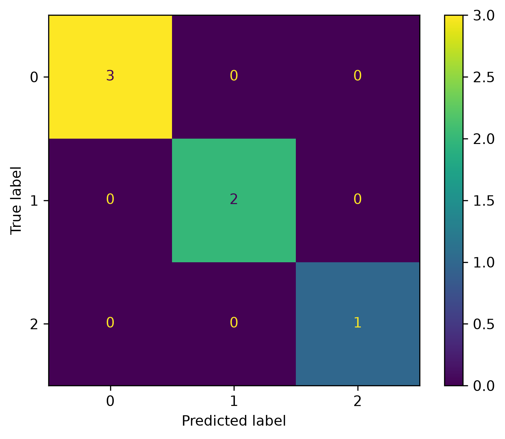

# Lab 12.4 – CNN-LSTM Hybrid Classifier

## Objective

The objective of this laboratory is to design, train, and evaluate a hybrid Convolutional Neural Network–Long Short-Term Memory (CNN-LSTM) model for EEG motor imagery classification.

The hybrid architecture combines the spatial feature extraction capability of CNN with the temporal sequence learning capability of LSTM to improve overall classification performance.

---

## Background

Hybrid Deep Learning models have become increasingly popular in Brain–Computer Interface (BCI) research because they combine the strengths of multiple neural network architectures.

In this implementation:

- CNN extracts high-level spatial representations from the EEG feature vectors.
- MaxPooling reduces feature dimensionality and computational complexity.
- LSTM learns temporal dependencies from the extracted features.
- Fully connected layers perform the final classification.

Compared with standalone CNN or LSTM models, CNN-LSTM networks generally provide improved classification performance for sequential biomedical signals.

---

## Python Script

```
labs/lab12_04_cnn_lstm_classifier.py
```

---

## Input Files

### Deep Learning Dataset

```
dl_data/X_train.npy
dl_data/X_test.npy
dl_data/y_train.npy
dl_data/y_test.npy
```

---

## Processing Steps

1. Load the prepared Deep Learning dataset.
2. Convert class labels to one-hot encoded vectors.
3. Build the CNN-LSTM hybrid architecture.
4. Compile the model using the Adam optimizer.
5. Configure training callbacks.
6. Train the network.
7. Predict testing samples.
8. Compute evaluation metrics.
9. Generate the confusion matrix.
10. Plot training accuracy and loss curves.
11. Save the trained model and training history.
12. Generate the evaluation report.

---

## CNN-LSTM Architecture

The implemented model consists of:

- Input Layer
- Conv1D Layer (32 Filters)
- MaxPooling1D Layer
- LSTM Layer (64 Units)
- Dropout Layer (30%)
- Dense Hidden Layer (32 Neurons)
- Softmax Output Layer

---

## Training Callbacks

The following callbacks were implemented:

- EarlyStopping
- ModelCheckpoint
- ReduceLROnPlateau

These callbacks reduce overfitting, automatically save the best-performing model, and improve training stability.

---

## Generated Files

### Final Model

```
deep_learning/cnn_lstm_classifier.keras
```

### Best Model

```
deep_learning/cnn_lstm_best.keras
```

### Training History

```
deep_learning/cnn_lstm_history.pkl
```

### Evaluation Report

```
results/lab12_04_cnn_lstm_report.txt
```

### Confusion Matrix

```
figures/lab12_cnn_lstm_confusion_matrix.png
```

### Accuracy Curve

```
figures/lab12_cnn_lstm_accuracy.png
```

### Loss Curve

```
figures/lab12_cnn_lstm_loss.png
```

### Documentation Images

```
docs/images/lab12_cnn_lstm_confusion_matrix.png
docs/images/lab12_cnn_lstm_accuracy.png
docs/images/lab12_cnn_lstm_loss.png
```

---

## Evaluation Metrics

The following evaluation metrics are automatically calculated:

- Accuracy
- Precision
- Recall
- F1-Score

A detailed classification report is also generated during execution.

---

## Figures

### CNN-LSTM Accuracy Curve


**Figure 12.7** Training and validation accuracy of the CNN-LSTM model.

---

### CNN-LSTM Loss Curve


**Figure 12.8** Training and validation loss during optimization.

---

### CNN-LSTM Confusion Matrix



**Figure 12.9** Confusion matrix obtained using the CNN-LSTM classifier.

---

## Discussion

The CNN-LSTM hybrid model integrates spatial feature extraction with temporal sequence learning, making it suitable for EEG signal classification.

The implemented callbacks improved training stability by preventing overfitting, reducing the learning rate when necessary, and preserving the best-performing model.

The obtained results will be compared with the standalone CNN and LSTM models in the next laboratory to determine the optimal Deep Learning classifier.

---

## Conclusion

A CNN-LSTM hybrid classifier was successfully implemented, trained, and evaluated.

The trained model, best-performing model, training history, learning curves, confusion matrix, and evaluation report were successfully generated and saved.

This laboratory represents the most advanced Deep Learning model developed in Chapter 12 and provides the basis for the final comparison of all Deep Learning classifiers.