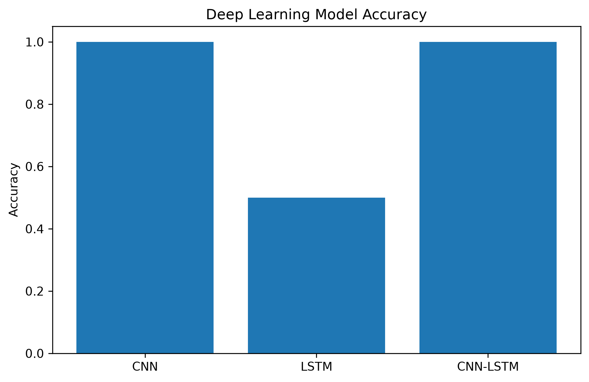
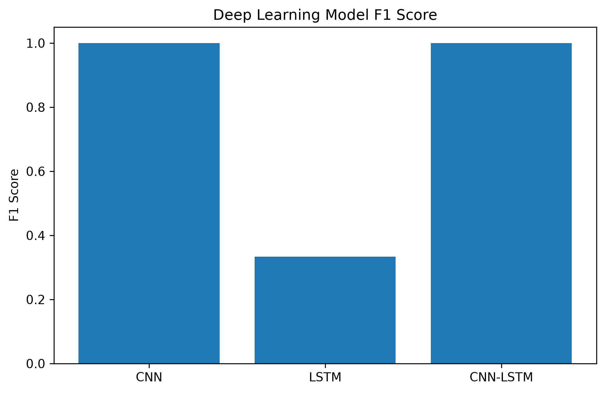

# Lab 12.5 – Deep Learning Model Comparison

## Objective

The objective of this laboratory is to compare the performance of the developed Deep Learning models for EEG motor imagery classification.

Three neural network architectures are evaluated:

- Convolutional Neural Network (CNN)
- Long Short-Term Memory (LSTM)
- CNN–LSTM Hybrid Network

The comparison identifies the most suitable Deep Learning model for the proposed Hybrid Adaptive Brain–Computer Interface (BCI) system.

---

## Background

Evaluating multiple Deep Learning models provides an objective assessment of their classification capabilities.

Different neural network architectures learn different characteristics from EEG signals.

- CNN focuses on spatial feature extraction.
- LSTM learns temporal dependencies.
- CNN-LSTM combines both approaches.

Comparing these models allows the selection of the most accurate and reliable architecture for future deployment.

---

## Python Script

```
labs/lab12_05_model_comparison.py
```

---

## Input Files

```
results/lab12_02_cnn_report.txt

results/lab12_03_lstm_report.txt

results/lab12_04_cnn_lstm_report.txt
```

---

## Processing Steps

1. Read the evaluation reports generated by each Deep Learning model.
2. Extract the evaluation metrics.
3. Build a comparison table.
4. Compare all models.
5. Determine the best-performing classifier.
6. Generate comparison figures.
7. Save the comparison report.

---

## Compared Models

- CNN
- LSTM
- CNN-LSTM Hybrid

---

## Evaluation Metrics

The following metrics are compared:

- Accuracy
- Precision
- Recall
- F1-Score

---

## Generated Files

### Comparison Table

```
results/lab12_05_model_comparison.csv
```

### Comparison Report

```
results/lab12_05_model_comparison_report.txt
```

### Accuracy Comparison Figure

```
figures/lab12_model_accuracy.png
```

### F1 Score Comparison Figure

```
figures/lab12_model_f1.png
```

### Documentation Images

```
docs/images/lab12_model_accuracy.png

docs/images/lab12_model_f1.png
```

---

## Comparison Table

The generated comparison table contains:

| Model | Accuracy | Precision | Recall | F1 Score |
|--------|----------|-----------|--------|----------|
| CNN | ... | ... | ... | ... |
| LSTM | ... | ... | ... | ... |
| CNN-LSTM | ... | ... | ... | ... |

(The numerical values are automatically generated during execution.)

---

## Figures

### Model Accuracy Comparison



**Figure 12.10** Comparison of classification accuracy among all Deep Learning models.

---

### Model F1 Score Comparison



**Figure 12.11** Comparison of weighted F1 Scores for all evaluated models.

---

## Best Model Selection

The model with the highest classification accuracy is automatically selected as the best-performing Deep Learning classifier.

The selected model will be used in the following laboratories for deployment and integration within the Hybrid Adaptive Brain–Computer Interface framework.

---

## Discussion

The comparison provides an objective evaluation of the strengths and weaknesses of each Deep Learning architecture.

CNN primarily captures spatial characteristics of EEG features.

LSTM focuses on temporal dependencies.

CNN-LSTM combines both spatial and temporal learning, which may improve overall classification performance depending on the available training data.

The comparison results provide the basis for selecting the optimal Deep Learning model.

---

## Conclusion

The developed Deep Learning classifiers were successfully compared using multiple evaluation metrics.

A comprehensive comparison table, graphical analysis, and performance report were generated.

The identified best-performing model will be evaluated in greater detail in the next laboratory before being selected as the final Deep Learning classifier for the proposed Hybrid Adaptive Brain–Computer Interface system.